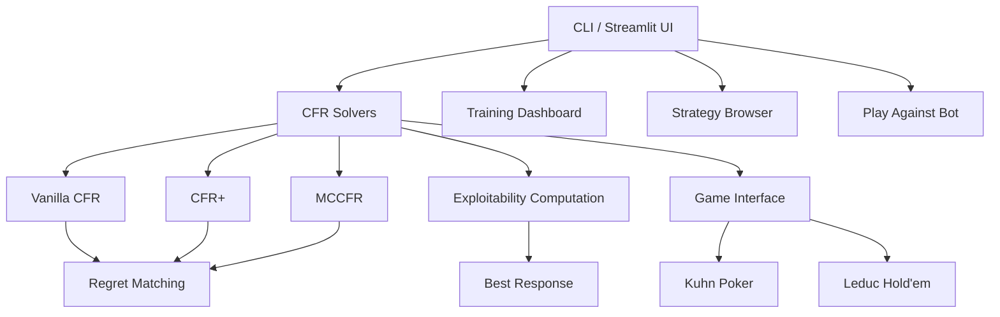

# Poker CFR Solver

A Python implementation of **Counterfactual Regret Minimization (CFR)** algorithms for solving imperfect-information extensive-form games. This solver computes Nash equilibrium strategies for poker variants, featuring an interactive Streamlit dashboard for visualization and play.

[](https://github.com/abhi-wadhwa/poker-cfr-solver/actions)
[](https://www.python.org/downloads/)
[](https://opensource.org/licenses/MIT)

---

## Problem Statement

**Imperfect-information games** like poker pose a fundamental challenge for AI: players must make decisions under uncertainty about the opponent's private information. Unlike chess or Go (perfect-information games), optimal play in poker requires *mixed strategies* — randomizing over actions to prevent exploitation.

The **Nash equilibrium** is the gold standard solution concept: a strategy profile where no player can improve their expected payoff by unilaterally changing their strategy. In two-player zero-sum games, a Nash equilibrium strategy is *unexploitable* — it guarantees at least the game-theoretic value regardless of the opponent's play.

This project implements the CFR family of algorithms that have driven breakthroughs in poker AI, from solving Heads-Up Limit Hold'em (Bowling et al., 2015) to superhuman No-Limit Hold'em play (Brown & Sandholm, 2019).

---

## Theory: Counterfactual Regret Minimization

### Extensive-Form Games

An extensive-form game is represented as a game tree where:
- **Chance nodes** model stochastic events (dealing cards)
- **Decision nodes** belong to a player who chooses an action
- **Terminal nodes** have associated payoffs for each player
- **Information sets** group decision nodes that a player cannot distinguish (same observable history)

### Regret Matching

At each information set, CFR maintains a **cumulative regret** vector. The strategy is derived via regret matching:

$$\sigma^{t+1}(a) = \frac{\max(R^t(a), 0)}{\sum_{b} \max(R^t(b), 0)}$$

If all regrets are non-positive, the strategy defaults to uniform random. The **average strategy** over all iterations converges to a Nash equilibrium.

### Counterfactual Value

The counterfactual value of an action $a$ at information set $I$ for player $i$ is:

$$v_i(I, a) = \sum_{z \in Z_I^a} \pi_{-i}^{\sigma}(z[I]) \cdot \pi^{\sigma}(z[I] \cdot a \to z) \cdot u_i(z)$$

where $\pi_{-i}^{\sigma}$ is the opponent's contribution to the reach probability and $u_i(z)$ is the terminal utility.

### Regret Update

The instantaneous counterfactual regret for action $a$ at information set $I$ is:

$$r^t(I, a) = v_i^{\sigma^t}(I, a) - v_i^{\sigma^t}(I)$$

Cumulative regret: $R^T(I, a) = \sum_{t=1}^{T} r^t(I, a)$

### Convergence Guarantee

**Theorem (Zinkevich et al., 2007):** In a two-player zero-sum game, if both players use regret matching, the average strategy profile converges to a Nash equilibrium at rate $O(1/\sqrt{T})$.

### Algorithm Variants

| Algorithm | Key Idea | Convergence Rate |
|-----------|----------|-----------------|
| **Vanilla CFR** | Full game tree traversal each iteration | $O(1/\sqrt{T})$ |
| **CFR+** | Clamp regrets to zero + linear averaging | $O(1/\sqrt{T})$ (faster in practice) |
| **MCCFR** | Sample opponent actions (external sampling) | $O(1/\sqrt{T})$ (in expectation) |

---

## Architecture



### Project Structure

```
poker-cfr-solver/
├── README.md                  # This file
├── Makefile                   # Build and run commands
├── pyproject.toml             # Project configuration and dependencies
├── Dockerfile                 # Container deployment
├── .github/workflows/ci.yml  # GitHub Actions CI pipeline
├── src/
│   ├── __init__.py
│   ├── core/
│   │   ├── __init__.py
│   │   ├── cfr.py             # Vanilla CFR implementation
│   │   ├── cfr_plus.py        # CFR+ with regret clamping
│   │   ├── mccfr.py           # Monte Carlo CFR (external sampling)
│   │   ├── regret_matching.py # Regret-matched strategy nodes
│   │   └── exploitability.py  # Best-response exploitability metric
│   ├── games/
│   │   ├── __init__.py
│   │   ├── game_base.py       # Abstract extensive-form game interface
│   │   ├── kuhn_poker.py      # Kuhn Poker (3 cards, 2 players)
│   │   └── leduc_holdem.py    # Leduc Hold'em (6 cards, 2 rounds)
│   ├── viz/
│   │   ├── __init__.py
│   │   └── app.py             # Streamlit interactive dashboard
│   └── cli.py                 # Typer CLI
├── tests/
│   ├── __init__.py
│   ├── test_cfr.py            # Algorithm convergence tests
│   ├── test_kuhn.py           # Game tree and Nash equilibrium tests
│   └── test_exploitability.py # Exploitability and regret matching tests
├── examples/
│   └── demo.py                # Quick demo script
└── LICENSE
```

---

## Quickstart

### Installation

```bash
# Clone the repository
git clone https://github.com/abhi-wadhwa/poker-cfr-solver.git
cd poker-cfr-solver

# Install with development dependencies
pip install -e ".[dev]"
```

### Train and View Strategies

```bash
# Train Vanilla CFR on Kuhn Poker
make train

# Show the computed Nash equilibrium
make show

# Benchmark all three algorithms
make benchmark
```

### Interactive Dashboard

```bash
make run
# Opens Streamlit at http://localhost:8501
```

The dashboard features three pages:

1. **Training Dashboard** — Select a game and algorithm, watch exploitability converge in real-time, and see strategy evolution charts.

2. **Strategy Browser** — Explore all information sets and their Nash equilibrium strategies after training.

3. **Play Against Bot** — Play Kuhn Poker hands against a CFR-trained bot that plays the Nash equilibrium strategy.

<!-- Screenshots -->
<!--  -->
<!--  -->
<!--  -->

### CLI Usage

```bash
# Train with specific settings
python -m src.cli train --game kuhn --algo cfr-plus --iterations 5000

# View Nash equilibrium strategy
python -m src.cli show --game kuhn --algo cfr --iterations 10000

# Compare all algorithms
python -m src.cli benchmark --game kuhn --iterations 10000
```

### Docker

```bash
docker build -t poker-cfr-solver .
docker run -p 8501:8501 poker-cfr-solver
```

### Run Tests

```bash
make test
# or
pytest tests/ -v --cov=src
```

---

## Games

### Kuhn Poker

The simplest non-trivial poker game (Kuhn, 1950):
- **Deck:** 3 cards — Jack, Queen, King
- **Players:** 2, each antes 1 chip
- **Deal:** Each player receives one card
- **Betting:** Single round — check/bet, then fold/call
- **Showdown:** Higher card wins

The Nash equilibrium is analytically known, making it ideal for verifying CFR implementations. Key properties:
- Player 0 with Jack bluffs with probability alpha in [0, 1/3]
- Player 0 with King always bets
- Player 1 with King always calls a bet
- Player 1 with Jack always folds to a bet
- Game value: -1/18 for Player 0

### Leduc Hold'em

A larger poker variant (Southey et al., 2005):
- **Deck:** 6 cards — JJ, QQ, KK (two suits per rank)
- **Players:** 2, each antes 1 chip
- **Round 1:** Private card dealt, bet size = 2, up to 2 raises
- **Community card** dealt face-up
- **Round 2:** Bet size = 4, up to 2 raises
- **Showdown:** Pair with community card beats high card; else higher rank wins

This game has approximately 936 information sets, providing a more challenging benchmark.

---

## References

1. **Zinkevich, M., Johanson, M., Bowling, M., & Piccione, C.** (2007). "Regret Minimization in Games with Incomplete Information." *Advances in Neural Information Processing Systems (NeurIPS)*. [(Paper)](https://papers.nips.cc/paper/2007/hash/08d98638c6fcd194a4b1e6992063e944-Abstract.html)

2. **Bowling, M., Burch, N., Johanson, M., & Tammelin, O.** (2015). "Heads-up Limit Hold'em Poker is Solved." *Science*, 347(6218), 145-149. [(Paper)](https://www.science.org/doi/10.1126/science.1259433)

3. **Brown, N., & Sandholm, T.** (2019). "Superhuman AI for Multiplayer Poker." *Science*, 365(6456), 885-890. [(Paper)](https://www.science.org/doi/10.1126/science.aay2400)

4. **Lanctot, M., Waugh, K., Zinkevich, M., & Bowling, M.** (2009). "Monte Carlo Sampling for Regret Minimization in Extensive Games." *Advances in Neural Information Processing Systems (NeurIPS)*. [(Paper)](https://papers.nips.cc/paper/2009/hash/00411460f7c92d2124a67ea0f4cb5f85-Abstract.html)

5. **Tammelin, O.** (2014). "Solving Large Imperfect Information Games Using CFR+." *arXiv:1407.5042*. [(Paper)](https://arxiv.org/abs/1407.5042)

6. **Hart, S., & Mas-Colell, A.** (2000). "A Simple Adaptive Procedure Leading to Correlated Equilibrium." *Econometrica*, 68(5), 1127-1150.

---

## License

MIT License. See [LICENSE](LICENSE) for details.
